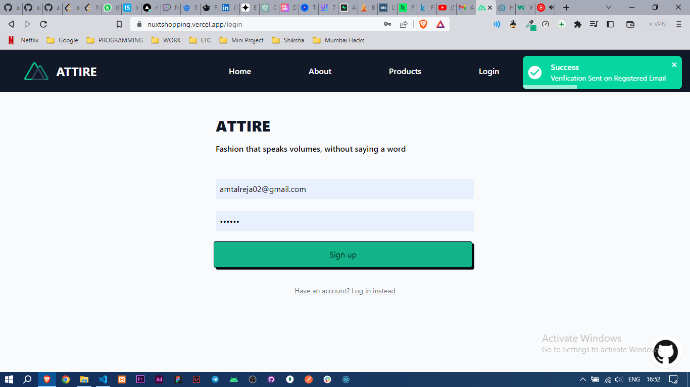
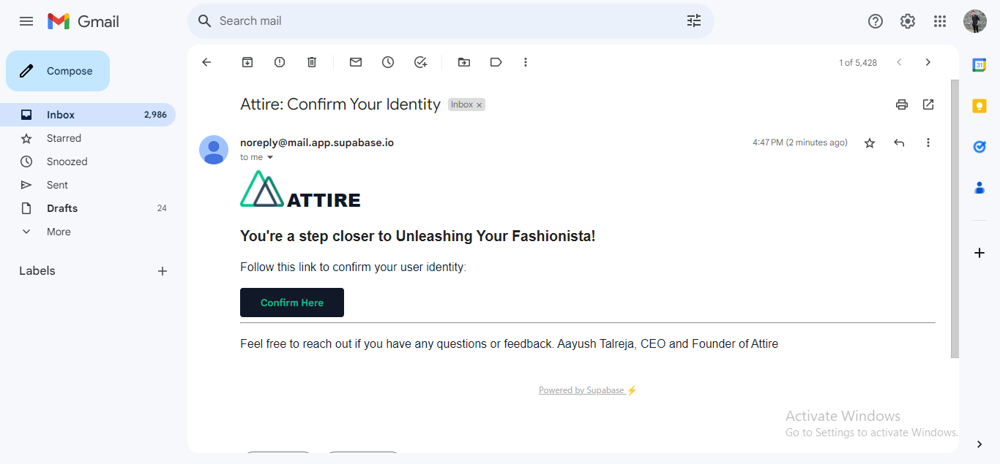
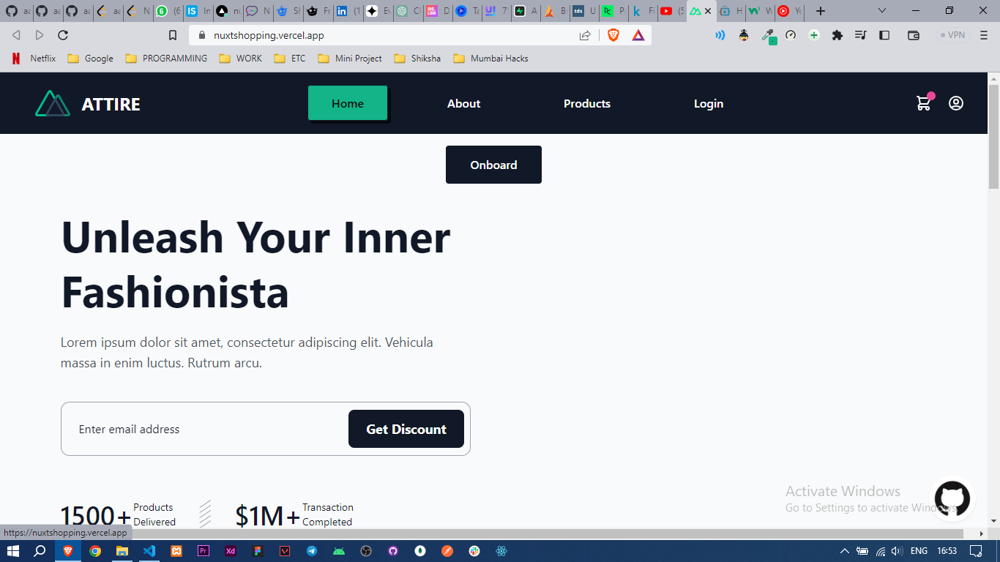
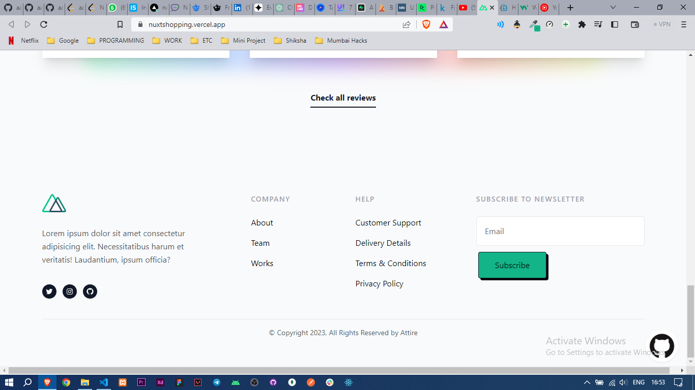
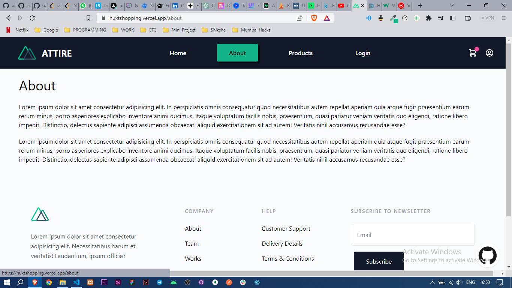
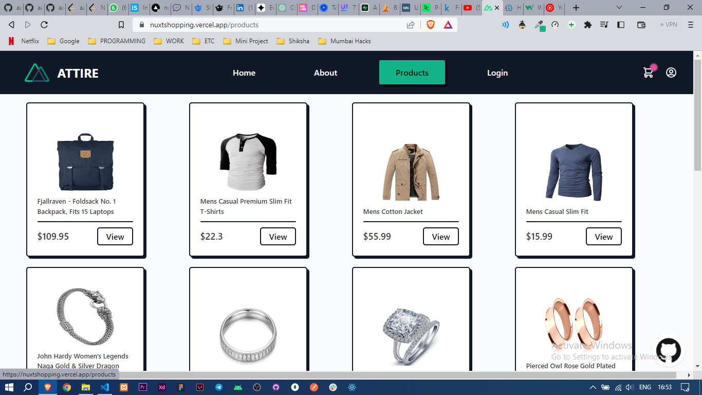
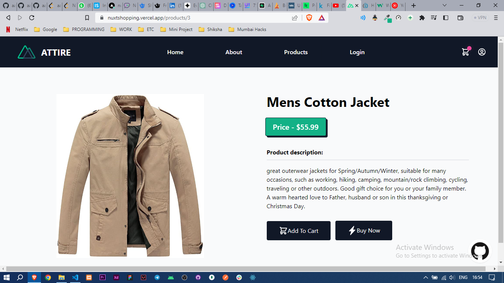
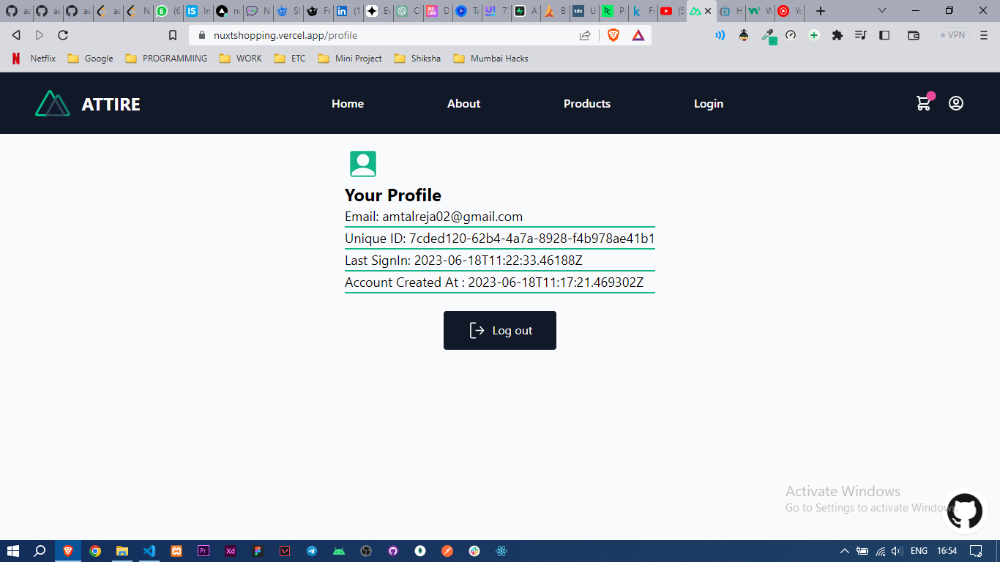

[](./LICENSE)
### Attire (Nuxt)
An Ecommerce website created using NuxtJS <br/>

### Built With
 <br/>
 <br/>
 <br/>


<hr/>

### Installation

_Installing and setting the webapp._

1. Get a free API Key at [https://fakestoreapi.com](https://fakestoreapi.com)
2. Clone the repo
   ```sh
   git clone https://github.com/aayu5hgit/nuxt-shopping.git
   ```
3. Install NPM packages
   ```sh
   npm install
   ```
4. Run the app
   ```sh
   npm run dev
   ```

<hr/>

### Screenshots
<details>
   <summary>SignUp Page</summary>
   <br>
   
</details>
<details>
   <summary>Email Confirmation</summary>
   <br>
   
</details>
<details>
   <summary>Home Page</summary>
   <br>
   
   
   
   
</details>
<details>
   <summary>About Page</summary>
   <br>
   
</details>
<details>
   <summary>Products Page</summary>
   <br>
   
</details>
<details>
   <summary>Product Details Page</summary>
   <br>
   
</details>
<details>
   <summary>User Profile Page</summary>
   <br>
   
</details>

<details>
   <summary>Demo Video</summary>
   <br>
   <video src="https://github.com/aayu5hgit/nuxt-shopping/assets/86314754/3b657383-596e-4ff7-8fb0-d651e116a077"/>
   
</details>

<hr/>

### Acknowledgments

* [Fake Store API](https://fakestoreapi.com)
* [Nuxt](https://www.nuxt.com)
* [Nuxt Supabse](https://supabase.nuxtjs.org/)
